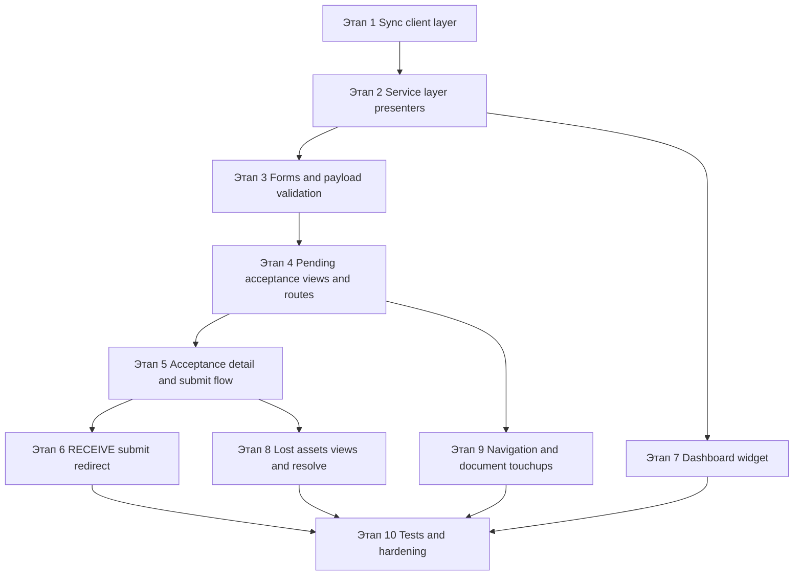

# Детальный план реализации acceptance, pending acceptance и lost assets в `Warehouse_web`

## 1. Цель и границы работ

Цель доработки — внедрить в [`Warehouse_web`](Warehouse_web) полноценный пользовательский контур для:

- pending acceptance списка для операций `RECEIVE` и `MOVE`
- отдельного acceptance-flow по операции
- различающегося post-submit поведения для `RECEIVE` и `MOVE`
- dashboard-виджета ожидающих приёмок
- репозитория `lost assets`: список, карточка, resolve

План опирается на:

- ТЗ [`Warehouse_web/plans/acceptance_receive_move_lost_assets_tz.md`](Warehouse_web/plans/acceptance_receive_move_lost_assets_tz.md)
- текущую реализацию операций в [`Warehouse_web/apps/operations/views.py`](Warehouse_web/apps/operations/views.py:244), [`Warehouse_web/apps/operations/services.py`](Warehouse_web/apps/operations/services.py:15), [`Warehouse_web/apps/operations/forms.py`](Warehouse_web/apps/operations/forms.py:9), [`Warehouse_web/apps/operations/urls.py`](Warehouse_web/apps/operations/urls.py:15)
- текущий dashboard в [`Warehouse_web/apps/client/views.py`](Warehouse_web/apps/client/views.py:28) и [`Warehouse_web/templates/client/dashboard.html`](Warehouse_web/templates/client/dashboard.html:1)
- существующие клиентские wrapper-patterns в [`Warehouse_web/apps/sync_client/operations_api.py`](Warehouse_web/apps/sync_client/operations_api.py:60), [`Warehouse_web/apps/sync_client/balances_api.py`](Warehouse_web/apps/sync_client/balances_api.py:15), [`Warehouse_web/apps/sync_client/recipients_api.py`](Warehouse_web/apps/sync_client/recipients_api.py:11)

## 2. Выводы по текущей кодовой базе

### 2.1. Что уже можно переиспользовать

1. [`apps.common.mixins.SyncContextMixin`](Warehouse_web/apps/common/mixins.py:8) уже собирает `SyncServerClient` и подходит для новых SSR-view.
2. [`apps.operations.services.OperationPageService`](Warehouse_web/apps/operations/services.py:15) уже выполняет presentation-логику для операций, умеет получать доступные склады и роль пользователя.
3. [`apps.operations.views.SubmitOperationView`](Warehouse_web/apps/operations/views.py:519) — естественная точка для встраивания redirect-логики после submit.
4. [`apps.operations.tests`](Warehouse_web/apps/operations/tests.py:23) уже содержит unit и view tests, значит новые тесты логично продолжать в этом модуле или разбить рядом на дополнительные test-модули.
5. [`templates/operations/list.html`](Warehouse_web/templates/operations/list.html:1) и [`templates/operations/detail.html`](Warehouse_web/templates/operations/detail.html:1) задают визуальный паттерн страниц операций, который можно использовать для новых acceptance/lost screens.

### 2.2. Ограничения текущего состояния

1. В [`apps.sync_client`](Warehouse_web/apps/sync_client) отсутствует asset-register wrapper для `pending-acceptance` и `lost-assets`.
2. В [`apps.operations.services.OperationPageService`](Warehouse_web/apps/operations/services.py:15) пока нет grouping line-level ответа в operation-level view model.
3. В [`apps.operations.forms`](Warehouse_web/apps/operations/forms.py:9) нет серверной валидации acceptance/lost resolve payload.
4. Dashboard в [`apps.client.views.dashboard`](Warehouse_web/apps/client/views.py:28) сейчас статический и не получает SyncServer-данные.
5. Sidebar в [`templates/includes/sidebar.html`](Warehouse_web/templates/includes/sidebar.html:1) пока не содержит навигации к pending acceptance и lost assets.
6. Обработка API-ошибок местами сделана локально через `messages`, местами централизована через [`apps.common.api_error_handler`](Warehouse_web/apps/common/api_error_handler.py:40), поэтому важно не смешать несколько конкурирующих подходов.

## 3. Архитектурная стратегия реализации

Реализацию целесообразно вести по рекомендованному в ТЗ порядку, но с уточнением по слоям:

1. **Sync client layer** — сначала закрыть все backend-контракты.
2. **Service layer** — затем собрать нормализованные presenter/view-model и payload builders.
3. **Forms and validation** — добавить серверную валидацию POST-flow.
4. **Views and routes** — поднять страницы и submit endpoints.
5. **Templates and navigation** — подключить UI и пользовательские entry points.
6. **Dashboard integration** — встраивать после готовности grouping-сервиса.
7. **Tests** — писать по ходу каждого этапа, но финально закрыть end-to-end сценарии слоя views.

Такой порядок минимизирует риск дублирования логики в [`views.py`](Warehouse_web/apps/operations/views.py:1) и позволяет использовать один и тот же service-layer для списка pending acceptance, acceptance detail, dashboard и lost assets.

## 4. Последовательность этапов с зависимостями

## 5. Детальный план по этапам

---

## Этап 1. Расширение sync client layer под acceptance и lost assets

### Цель этапа

Добавить в [`apps/sync_client`](Warehouse_web/apps/sync_client) полный набор wrapper-методов для работы с backend endpoints, чтобы остальная система не обращалась к raw path-строкам напрямую.

### Функциональные требования

- pending acceptance list
- pending acceptance pagination across pages
- lost assets list/detail/resolve
- accept-lines submit

### Файлы

#### Создать

- [`Warehouse_web/apps/sync_client/assets_api.py`](Warehouse_web/apps/sync_client/assets_api.py)

#### Изменить

- [`Warehouse_web/apps/sync_client/operations_api.py`](Warehouse_web/apps/sync_client/operations_api.py:60)
- при необходимости [`Warehouse_web/apps/sync_client/__init__.py`](Warehouse_web/apps/sync_client/__init__.py)

### Детальные шаги

1. В [`assets_api.py`](Warehouse_web/apps/sync_client/assets_api.py) добавить класс `AssetsAPI` по аналогии с [`BalancesAPI`](Warehouse_web/apps/sync_client/balances_api.py:15).
2. Реализовать методы:
   - `list_pending_acceptance filters`
   - `list_pending_acceptance_all_pages filters max_pages max_rows`
   - `list_lost_assets filters`
   - `get_lost_asset operation_line_id`
   - `resolve_lost_asset operation_line_id payload`
3. Нормализовать list-response в единый формат `items`, `total_count`, `page`, `page_size`.
4. В [`OperationsAPI`](Warehouse_web/apps/sync_client/operations_api.py:60) добавить `accept_operation_lines operation_id payload` для `POST /operations/{operation_id}/accept-lines`.
5. В `all_pages`-метод встроить safeguard из ТЗ:
   - ограничение по `max_pages`
   - ограничение по `max_rows`
   - безопасный fallback при превышении лимита
   - warning log без падения UI

### Сложность

**Средняя**

### Критические зависимости

- нет входящих зависимостей
- этот этап блокирует все дальнейшие этапы, кроме чисто шаблонных изменений

### Ожидаемый результат этапа

Сервисный и view-слой получают стабильный API-контракт без ручного дублирования URL и нормализации ответов.

---

## Этап 2. Расширение service layer и выделение presenter-логики acceptance/lost assets

### Цель этапа

Собрать единый уровень подготовки данных для UI, чтобы grouping, derived-поля и форматирование не размазывались по представлениям.

### Функциональные требования

- группировка pending rows в operation-level list
- определение `RECEIVE` или `MOVE` по `source_site_id`
- подготовка acceptance header и acceptance lines
- dashboard summary по уникальным операциям
- presentation lost assets list/detail

### Файлы

#### Изменить

- [`Warehouse_web/apps/operations/services.py`](Warehouse_web/apps/operations/services.py:15)

#### Опционально создать при разрастании файла

- [`Warehouse_web/apps/operations/acceptance_service.py`](Warehouse_web/apps/operations/acceptance_service.py)

### Детальные шаги

1. Принять решение, оставлять ли логику в [`OperationPageService`](Warehouse_web/apps/operations/services.py:15) или выносить acceptance/lost presenters в отдельный модуль.
2. Добавить нормализацию числовых полей и derived quantities:
   - `accepted_qty`
   - `lost_qty`
   - `remaining_qty`
   - `expected_qty`
3. Реализовать client-side grouping pending rows:
   - ключ группировки `operation_id`
   - вычисление `operation_type`
   - определение `destination_site_name`
   - определение `source_site_name`
   - агрегация числа строк
   - агрегация суммарного pending quantity
   - сбор preview ТМЦ
   - вычисление `updated_at_max`
4. Добавить presenter для acceptance detail:
   - шапка документа на базе [`OperationsAPI.get_operation`](Warehouse_web/apps/sync_client/operations_api.py:186)
   - строки на базе pending rows по `operation_id`
   - флаги `can_accept`, `has_lost_qty`, `is_resolved`, `is_in_progress`
5. Добавить service-метод dashboard summary:
   - уникальные операции
   - количество pending lines
   - breakdown по складам назначения
   - breakdown по типам операций
   - fallback-флаг, если данные обрезаны safeguard-лимитом
6. Добавить presenter для lost assets:
   - строки списка
   - detail model
   - available resolve actions
   - скрытие `return_to_source`, если нет `source_site_id`
7. Подготовить helper-методы для человекочитаемых `acceptance_state` и API-safe идентификаторов.

### Сложность

**Высокая**

### Критические зависимости

- зависит от Этапа 1
- блокирует Этапы 4, 5, 7 и 8

### Ожидаемый результат этапа

Все новые UI-экраны используют один общий набор presenter/view-model методов, а не собственные ad-hoc преобразования.

---

## Этап 3. Серверная валидация и формы для acceptance и lost resolve

### Цель этапа

Явно оформить POST-валидацию для acceptance-flow и lost resolve, чтобы ошибки были воспроизводимы, тестируемы и не зависели только от фронтенд-ограничений.

### Функциональные требования

- `accepted_qty >= 0`
- `lost_qty >= 0`
- нельзя отправлять строку без изменений
- `accepted_qty + lost_qty <= remaining_qty`
- partial resolve по `qty`
- опциональный `responsible_recipient_id`

### Файлы

#### Изменить

- [`Warehouse_web/apps/operations/forms.py`](Warehouse_web/apps/operations/forms.py:9)

#### Опционально создать при перегрузке файла

- [`Warehouse_web/apps/operations/acceptance_forms.py`](Warehouse_web/apps/operations/acceptance_forms.py)

### Детальные шаги

1. Сохранить текущий [`OperationCreateForm`](Warehouse_web/apps/operations/forms.py:9) без ломки существующего flow.
2. Добавить отдельную форму или form-like parser для acceptance submit, например:
   - `AcceptanceSubmitForm`
   - `AcceptanceLineInput`
3. Добавить форму или parser для lost resolve submit, например:
   - `LostAssetResolveForm`
4. Реализовать валидацию строк acceptance с привязкой ошибок к конкретной line-row.
5. Реализовать построение payload только по изменённым строкам.
6. Нормализовать `qty` и `note`, подготовить единый builder для `accept-lines` payload.
7. Для lost resolve поддержать action-specific validation:
   - `found_to_destination`
   - `return_to_source`
   - `write_off`
8. Не делать из клиента источник истины по правам, но делать минимальные UX-ограничения.

### Сложность

**Высокая**

### Критические зависимости

- зависит от Этапа 2, так как валидации нужен `remaining_qty` и availability actions
- блокирует Этапы 5 и 8

### Ожидаемый результат этапа

POST-flow получает формализованный, покрываемый тестами слой валидации и сборки payload.

---

## Этап 4. Экран списка Ожидают приёмки

### Цель этапа

Поднять основной task-entry point для кладовщика целевого склада.

### Функциональные требования

- operation-level таблица поверх line-level backend ответа
- фильтры поиск, склад назначения, тип операции, пагинация
- действия `Открыть приёмку` и `Открыть документ`
- корректный empty state

### Файлы

#### Изменить

- [`Warehouse_web/apps/operations/views.py`](Warehouse_web/apps/operations/views.py:244)
- [`Warehouse_web/apps/operations/urls.py`](Warehouse_web/apps/operations/urls.py:15)
- при необходимости [`Warehouse_web/apps/operations/services.py`](Warehouse_web/apps/operations/services.py:15)

#### Создать

- [`Warehouse_web/templates/operations/pending_acceptance_list.html`](Warehouse_web/templates/operations/pending_acceptance_list.html)

### Детальные шаги

1. Добавить class-based view `PendingAcceptanceListView` в [`views.py`](Warehouse_web/apps/operations/views.py:1).
2. Подключить route `operations:pending_acceptance` в [`urls.py`](Warehouse_web/apps/operations/urls.py:15).
3. В view:
   - разобрать query params
   - вызвать [`AssetsAPI.list_pending_acceptance`](Warehouse_web/apps/sync_client/assets_api.py)
   - через service-layer сгруппировать строки по операциям
   - собрать options по складам назначения
4. В шаблоне вывести operation-level таблицу с колонками из ТЗ.
5. Добавить CTA:
   - переход в [`operations:acceptance_detail`](Warehouse_web/apps/operations/urls.py:15)
   - переход в [`operations:detail`](Warehouse_web/apps/operations/urls.py:20)
6. Для `observer` не показывать рабочий CTA на приёмку, но сохранять read-only документный переход при необходимости.
7. Подготовить предсказуемый empty state и отображение ошибок SyncServer.

### Сложность

**Средняя**

### Критические зависимости

- зависит от Этапов 1 и 2
- блокирует пользовательский вход в Этап 5 и частично Этап 7

### Ожидаемый результат этапа

В системе появляется новый рабочий раздел для открытия acceptance-задач по операциям `RECEIVE` и `MOVE`.

---

## Этап 5. Отдельный acceptance screen и submit flow accept-lines

### Цель этапа

Реализовать task-oriented страницу приёмки операции, отличную от документной карточки.

### Функциональные требования

- отдельный route для acceptance detail
- загрузка document header и pending lines
- частичная приёмка
- частичная потеря
- сохранение пользовательского ввода при ошибке
- banner с переходом в lost assets при появлении потерь

### Файлы

#### Изменить

- [`Warehouse_web/apps/operations/views.py`](Warehouse_web/apps/operations/views.py:244)
- [`Warehouse_web/apps/operations/urls.py`](Warehouse_web/apps/operations/urls.py:15)
- [`Warehouse_web/apps/operations/forms.py`](Warehouse_web/apps/operations/forms.py:9)
- [`Warehouse_web/apps/sync_client/operations_api.py`](Warehouse_web/apps/sync_client/operations_api.py:314)
- при необходимости [`Warehouse_web/apps/operations/services.py`](Warehouse_web/apps/operations/services.py:15)

#### Создать

- [`Warehouse_web/templates/operations/acceptance_detail.html`](Warehouse_web/templates/operations/acceptance_detail.html)

### Детальные шаги

1. Добавить view `AcceptanceDetailView`.
2. Добавить POST-view `AcceptanceSubmitView`.
3. Подключить routes:
   - `operations:acceptance_detail`
   - `operations:acceptance_submit`
4. В `GET`-ветке загрузить:
   - документ через [`OperationsAPI.get_operation`](Warehouse_web/apps/sync_client/operations_api.py:186)
   - pending rows по `operation_id` через [`AssetsAPI.list_pending_acceptance`](Warehouse_web/apps/sync_client/assets_api.py)
5. Через service-layer подготовить header и lines view-model.
6. В шаблоне показать:
   - тип операции
   - статус документа
   - `acceptance_state`
   - склад назначения
   - склад-источник для `MOVE`
   - таблицу строк с `accepted_qty`, `lost_qty`, `remaining_qty`, `note`
7. В POST-ветке:
   - валидировать вход через форму Этапа 3
   - собрать payload только из изменённых строк
   - вызвать [`accept_operation_lines`](Warehouse_web/apps/sync_client/operations_api.py:314)
8. После успеха:
   - при оставшихся строках остаться на acceptance screen
   - при полном завершении показать resolved-state
   - при образовании потерь показать заметный banner и ссылку на [`operations:lost_assets`](Warehouse_web/apps/operations/urls.py:15)
9. При `409`, `422`, `403` сохранять пользовательский ввод и показывать точные сообщения.

### Сложность

**Высокая**

### Критические зависимости

- зависит от Этапов 1, 2 и 3
- блокирует Этапы 6 и 8

### Ожидаемый результат этапа

Пользователь может принимать операции по специализированному экрану, включая partial acceptance и lost creation.

---

## Этап 6. Разделение flow для RECEIVE и MOVE после submit

### Цель этапа

Встроить различный post-submit маршрут в существующий lifecycle документа без поломки журналов и карточек.

### Функциональные требования

- `RECEIVE` после submit направляет в acceptance-flow при наличии прав
- `MOVE` не делает auto-redirect в acceptance-flow
- existing flow не ломается при отсутствии прав или backend-ошибке

### Файлы

#### Изменить

- [`Warehouse_web/apps/operations/views.py`](Warehouse_web/apps/operations/views.py:519)
- при необходимости [`Warehouse_web/apps/operations/services.py`](Warehouse_web/apps/operations/services.py:15)
- опционально [`Warehouse_web/templates/operations/detail.html`](Warehouse_web/templates/operations/detail.html:1)

### Детальные шаги

1. До или после submit определить тип операции через [`OperationsAPI.get_operation`](Warehouse_web/apps/sync_client/operations_api.py:186) либо использовать submit-response, если он содержит достаточно данных.
2. В [`SubmitOperationView.post`](Warehouse_web/apps/operations/views.py:520) добавить conditional redirect:
   - если тип `RECEIVE` и пользователь имеет доступ к приёмке destination site, redirect в [`operations:acceptance_detail`](Warehouse_web/apps/operations/urls.py:15)
   - если тип `MOVE`, оставить redirect в документ или переданный `next`
   - если прав нет, показать success-message и не ломать старый путь
3. При необходимости в document detail добавить read-only блок о состоянии приёмки и ссылку в acceptance-flow, но не делать его главным entry point для `MOVE`.
4. Убедиться, что поведение не ломает существующие submit tests и ручной сценарий обычных операций.

### Сложность

**Средняя**

### Критические зависимости

- зависит от Этапов 2 и 5
- влияет на acceptance entry UX и тесты редиректов

### Ожидаемый результат этапа

`RECEIVE` и `MOVE` начинают вести пользователя по разным сценариям в точном соответствии с ТЗ.

---

## Этап 7. Dashboard widget ожидающих приёмок

### Цель этапа

Дать пользователю быстрый обзор pending acceptance и короткий путь в рабочий список.

### Функциональные требования

- количество уникальных операций
- количество строк ожидания
- breakdown по складам назначения
- при желании breakdown по типам
- CTA в pending acceptance list

### Файлы

#### Изменить

- [`Warehouse_web/apps/client/views.py`](Warehouse_web/apps/client/views.py:28)
- [`Warehouse_web/templates/client/dashboard.html`](Warehouse_web/templates/client/dashboard.html:1)
- при необходимости [`Warehouse_web/apps/operations/services.py`](Warehouse_web/apps/operations/services.py:15)

### Детальные шаги

1. Определить, будет ли dashboard использовать [`OperationPageService`](Warehouse_web/apps/operations/services.py:15) напрямую или вынесенный acceptance presenter.
2. В [`dashboard`](Warehouse_web/apps/client/views.py:28) добавить вызов summary-сервиса.
3. Использовать [`AssetsAPI.list_pending_acceptance_all_pages`](Warehouse_web/apps/sync_client/assets_api.py) с safeguard-лимитом.
4. Передать в шаблон:
   - `pending_operations_count`
   - `pending_lines_count`
   - `pending_by_destination_site`
   - `pending_by_operation_type`
   - `pending_summary_truncated`
5. В шаблоне [`dashboard.html`](Warehouse_web/templates/client/dashboard.html:1) добавить карточку виджета и CTA на [`operations:pending_acceptance`](Warehouse_web/apps/operations/urls.py:15).
6. Предусмотреть safe fallback при недоступности API или срабатывании limit safeguard.

### Сложность

**Средняя**

### Критические зависимости

- зависит от Этапов 1 и 2
- желательно выполнять после Этапа 4, чтобы CTA уже вёл на существующий экран

### Ожидаемый результат этапа

Dashboard показывает реальную рабочую нагрузку по pending acceptance, а не только статические ссылки.

---

## Этап 8. Репозиторий lost assets: список, карточка, resolve

### Цель этапа

Замкнуть контур обработки потерь, возникающих в acceptance-flow.

### Функциональные требования

- список lost assets
- карточка lost asset
- partial resolve
- поддержка `found_to_destination`, `return_to_source`, `write_off`
- обновление detail и list после resolve

### Файлы

#### Изменить

- [`Warehouse_web/apps/operations/views.py`](Warehouse_web/apps/operations/views.py:244)
- [`Warehouse_web/apps/operations/urls.py`](Warehouse_web/apps/operations/urls.py:15)
- [`Warehouse_web/apps/operations/forms.py`](Warehouse_web/apps/operations/forms.py:9)
- [`Warehouse_web/apps/operations/services.py`](Warehouse_web/apps/operations/services.py:15)

#### Создать

- [`Warehouse_web/templates/operations/lost_assets_list.html`](Warehouse_web/templates/operations/lost_assets_list.html)
- [`Warehouse_web/templates/operations/lost_asset_detail.html`](Warehouse_web/templates/operations/lost_asset_detail.html)

### Детальные шаги

1. Добавить views:
   - `LostAssetsListView`
   - `LostAssetDetailView`
   - `LostAssetResolveView`
2. Подключить routes:
   - `operations:lost_assets`
   - `operations:lost_asset_detail`
   - `operations:lost_asset_resolve`
3. Для списка реализовать query-фильтры из ТЗ и отображение пагинации.
4. Для карточки загружать detail через [`AssetsAPI.get_lost_asset`](Warehouse_web/apps/sync_client/assets_api.py).
5. В detail template показать доступные resolve actions с учётом backend-контракта.
6. Через форму Этапа 3 валидировать `qty`, `note`, `responsible_recipient_id`.
7. Показывать `return_to_source` только при наличии `source_site_id`.
8. После успешного resolve:
   - redirect обратно в detail
   - success-message
   - при необходимости обновление списка через новый запрос
9. Явно обрабатывать `403`, `404`, `409`, `422` и не скрывать серверный конфликт.

### Сложность

**Высокая**

### Критические зависимости

- зависит от Этапов 1, 2, 3 и желательно 5
- функционально связан с acceptance-loss flow

### Ожидаемый результат этапа

Потери становятся управляемыми через отдельный SSR-контур без обращения к внешним инструментам.

---

## Этап 9. Навигация, вторичные экраны и UX-согласованность

### Цель этапа

Связать новые экраны между собой и встроить их в существующий пользовательский интерфейс.

### Функциональные требования

- доступность разделов из sidebar
- переходы между dashboard, pending acceptance, document detail и lost assets
- read-only acceptance info на карточке документа при необходимости

### Файлы

#### Изменить

- [`Warehouse_web/templates/includes/sidebar.html`](Warehouse_web/templates/includes/sidebar.html:1)
- [`Warehouse_web/templates/operations/detail.html`](Warehouse_web/templates/operations/detail.html:1)
- при необходимости [`Warehouse_web/templates/base.html`](Warehouse_web/templates/base.html)
- при необходимости [`Warehouse_web/static/css/app.css`](Warehouse_web/static/css/app.css)

### Детальные шаги

1. Добавить в sidebar ссылки на:
   - pending acceptance
   - lost assets
2. Проверить active-state для новых route names.
3. На карточке документа добавить read-only секцию acceptance-state для `RECEIVE` и `MOVE`, если данные доступны.
4. Добавить cross-links:
   - из acceptance detail в lost assets
   - из lost asset detail в документ
   - из dashboard в pending acceptance
5. При необходимости доработать CSS для новых таблиц, баннеров, chips и error blocks.

### Сложность

**Низкая–средняя**

### Критические зависимости

- зависит от Этапов 4, 5, 7 и 8
- финализирует пользовательский контур, но не должен блокировать core backend integration

### Ожидаемый результат этапа

Новые сценарии становятся discoverable и согласованными с остальным интерфейсом Warehouse_web.

---

## Этап 10. Тесты, hardening и регрессионная стабилизация

### Цель этапа

Закрыть критические вычисления, маршруты и ошибки тестами, не требуя реального SyncServer в тестовом окружении Django.

### Функциональные требования

- unit tests для grouping, summary, payload builders
- view tests для redirect, permission UX и error handling
- integration-like tests с mock API responses

### Файлы

#### Изменить

- [`Warehouse_web/apps/operations/tests.py`](Warehouse_web/apps/operations/tests.py:23)
- [`Warehouse_web/apps/client/tests.py`](Warehouse_web/apps/client/tests.py:1)

#### Опционально создать для декомпозиции

- [`Warehouse_web/apps/operations/tests/test_acceptance_services.py`](Warehouse_web/apps/operations/tests/test_acceptance_services.py)
- [`Warehouse_web/apps/operations/tests/test_acceptance_views.py`](Warehouse_web/apps/operations/tests/test_acceptance_views.py)
- [`Warehouse_web/apps/operations/tests/test_lost_assets_views.py`](Warehouse_web/apps/operations/tests/test_lost_assets_views.py)
- [`Warehouse_web/apps/client/tests/test_dashboard_pending_widget.py`](Warehouse_web/apps/client/tests/test_dashboard_pending_widget.py)

### Детальные шаги

1. Unit tests на service-layer:
   - grouping pending rows
   - вычисление `RECEIVE` или `MOVE`
   - dashboard summary по уникальным `operation_id`
   - форматирование remaining quantities
   - скрытие `return_to_source`
2. Unit tests на forms/payload:
   - `accepted_qty + lost_qty <= remaining_qty`
   - строки без изменений не входят в payload
   - partial resolve `qty`
3. View tests:
   - pending acceptance list render
   - acceptance detail render
   - acceptance submit success and conflict handling
   - redirect после submit `RECEIVE`
   - отсутствие auto-redirect для `MOVE`
   - lost assets list/detail/resolve
4. Dashboard tests:
   - summary successful render
   - safe fallback при truncated all-pages summary
5. Проверить регрессию существующих create/detail/submit/cancel сценариев операций.

### Сложность

**Высокая**

### Критические зависимости

- зависит от завершения Этапов 1–9
- нужен для безопасного переключения к внедрению и последующей поддержке

### Ожидаемый результат этапа

Критичные сценарии покрыты тестами, а риск регрессии существующего operation-flow существенно снижен.

## 6. Карта требований к этапам

| Требование | Этапы |
| --- | --- |
| Раздел Ожидают приёмки | Этапы 1, 2, 4, 9, 10 |
| Отдельный acceptance screen | Этапы 1, 2, 3, 5, 9, 10 |
| Разные flow для RECEIVE и MOVE | Этапы 2, 5, 6, 10 |
| Виджет ожидаемых приёмок на dashboard | Этапы 1, 2, 7, 9, 10 |
| Репозиторий lost assets | Этапы 1, 2, 3, 8, 9, 10 |
| Корректная обработка API ошибок | Этапы 3, 5, 8, 10 |

## 7. Подход к тестированию

### 7.1. Unit tests

Основной фокус unit-уровня:

- presenter/grouping logic в [`apps/operations/services.py`](Warehouse_web/apps/operations/services.py:15)
- формы и payload builders в [`apps/operations/forms.py`](Warehouse_web/apps/operations/forms.py:9)
- нормализация list responses в [`apps/sync_client/assets_api.py`](Warehouse_web/apps/sync_client/assets_api.py)

Рекомендуемые unit-сценарии:

1. Группировка line-level pending rows в operation-level модель.
2. Корректное определение `MOVE`, если задан `source_site_id`.
3. Корректное определение `RECEIVE`, если `source_site_id` отсутствует.
4. Подсчёт dashboard summary по уникальным операциям, а не по строкам.
5. Сбор payload для `accept-lines` только из изменённых строк.
6. Валидация `accepted_qty + lost_qty <= remaining_qty`.
7. Скрытие action `return_to_source` без source site.
8. Поддержка partial resolve `qty`.
9. Safe fallback, если all-pages loader достиг лимита.

### 7.2. Integration-style tests на Django views с mock API

Основной фокус:

- HTML-рендеринг страниц
- redirect-ветки
- message handling
- permission-sensitive CTA

Рекомендуемые сценарии:

1. Открытие [`PendingAcceptanceListView`](Warehouse_web/apps/operations/views.py:244) с mock response от [`AssetsAPI`](Warehouse_web/apps/sync_client/assets_api.py).
2. Открытие [`AcceptanceDetailView`](Warehouse_web/apps/operations/views.py:244) с документом и pending rows.
3. Успешный submit acceptance с повторным открытием экрана.
4. Conflict `409` на acceptance submit с сохранением данных формы.
5. Redirect из [`SubmitOperationView`](Warehouse_web/apps/operations/views.py:519) в acceptance-flow для `RECEIVE`.
6. Отсутствие redirect в acceptance-flow для `MOVE`.
7. Рендер списка lost assets с фильтрами.
8. Успешный resolve lost asset.
9. Обработка `403`, `404`, `409`, `422` для lost resolve.
10. Рендер dashboard widget при нормальном и truncated-summary сценарии.

### 7.3. Что не требуется для тестирования

- не нужен реальный поднятый SyncServer
- не нужно e2e browser automation как обязательный критерий
- не нужно дублировать бизнес-правила backend за пределами UX-валидации

## 8. Потенциальные риски и mitigation

| Риск | Почему реален | Mitigation |
| --- | --- | --- |
| Расхождение payload между ТЗ и реальным backend | В ТЗ уже зафиксировано отличие по `found_to_destination` | На старте реализации зафиксировать контракт в [`assets_api.py`](Warehouse_web/apps/sync_client/assets_api.py) и не проектировать поля сверх backend-схемы |
| Разрастание [`apps/operations/views.py`](Warehouse_web/apps/operations/views.py:1) | Файл уже содержит create, detail, submit, cancel и item AJAX | Вынести parsing/presenter/payload logic в service/forms слой, а при необходимости отделить [`acceptance_service.py`](Warehouse_web/apps/operations/acceptance_service.py) |
| Дублирование логики между pending list, acceptance detail и dashboard | Все три сценария используют pending rows и grouping | Сделать один общий grouping-summary presenter на Этапе 2 |
| Ошибки при partial acceptance и повторном открытии формы | Остатки вычисляются из динамического backend состояния | Всегда перечитывать pending rows при `GET`, а в `POST` полагаться на backend как арбитра и корректно обрабатывать `409` |
| Неверная маршрутизация после submit RECEIVE | Текущий submit flow очень простой и возвращает `next` | Ввести явное ветвление только для `RECEIVE`, покрыть view-тестами redirect-ветки |
| Observer увидит рабочие CTA | Сейчас роль учитывается в service-layer не во всех новых сценариях | Централизовать флаги `can_accept`, `can_resolve_lost` в presenter и шаблонах |
| Неполные данные widget из-за пагинации | Backend считает `total_count` по строкам, а не по операциям | Использовать `all_pages` loader с лимитами и выводить fallback-state |
| Перегрузка шаблонов сложной табличной формой | Acceptance и lost detail содержат row-level inputs и ошибки | Использовать единые partial/presenter-структуры и CSS-компоненты, не усложнять template arithmetic |
| Регрессия существующих операций | Меняется submit flow и document detail | Сохранить обратную совместимость в [`OperationDetailView`](Warehouse_web/apps/operations/views.py:305) и покрыть regression tests |

## 9. Рекомендуемый рабочий порядок для режима реализации

1. Этап 1 — Sync client layer
2. Этап 2 — Service layer presenters
3. Этап 3 — Forms and validation
4. Этап 4 — Pending acceptance list
5. Этап 5 — Acceptance detail and submit
6. Этап 6 — RECEIVE redirect logic
7. Этап 7 — Dashboard widget
8. Этап 8 — Lost assets list/detail/resolve
9. Этап 9 — Navigation and UX touchups
10. Этап 10 — Tests and hardening

## 10. Actionable checklist для следующего режима

- [ ] Добавить [`AssetsAPI`](Warehouse_web/apps/sync_client/assets_api.py) и `accept_operation_lines` в [`OperationsAPI`](Warehouse_web/apps/sync_client/operations_api.py:60)
- [ ] Реализовать grouping и summary presenter для pending acceptance, acceptance detail, dashboard и lost assets
- [ ] Добавить серверную валидацию acceptance submit и lost resolve submit
- [ ] Поднять [`operations:pending_acceptance`](Warehouse_web/apps/operations/urls.py:15) и шаблон [`pending_acceptance_list.html`](Warehouse_web/templates/operations/pending_acceptance_list.html)
- [ ] Поднять [`operations:acceptance_detail`](Warehouse_web/apps/operations/urls.py:15) и [`operations:acceptance_submit`](Warehouse_web/apps/operations/urls.py:15)
- [ ] Встроить redirect для `RECEIVE` в acceptance-flow после submit без изменения `MOVE`-поведения
- [ ] Добавить pending acceptance widget в [`dashboard`](Warehouse_web/apps/client/views.py:28)
- [ ] Реализовать [`operations:lost_assets`](Warehouse_web/apps/operations/urls.py:15), [`operations:lost_asset_detail`](Warehouse_web/apps/operations/urls.py:15), [`operations:lost_asset_resolve`](Warehouse_web/apps/operations/urls.py:15)
- [ ] Обновить [`sidebar.html`](Warehouse_web/templates/includes/sidebar.html:1) и при необходимости [`detail.html`](Warehouse_web/templates/operations/detail.html:1)
- [ ] Закрыть unit и integration-style тестами новые вычисления, маршруты, redirect и error handling
