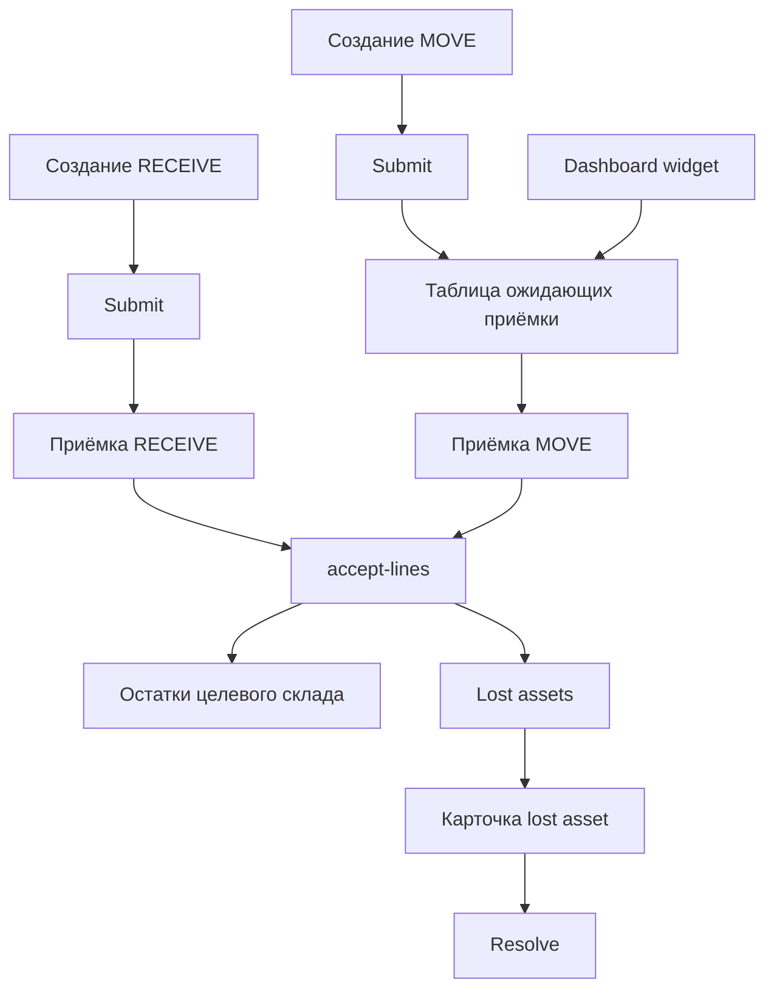

# ТЗ для агента: приёмка RECEIVE и MOVE, дашборд ожидаемых приёмок, репозиторий lost assets в Warehouse_web

## 1. Контекст и source of truth

### Бизнес-контекст

- Реализовать в Django-клиенте `Warehouse_web` пользовательский контур приёмки для операций `RECEIVE` и `MOVE`
- Приёмку выполняет кладовщик целевого склада
- Для `RECEIVE` экран приёмки должен быть доступен сразу по ходу работы с только что созданной операцией, но также операция должна повторно открываться из таблицы ожидающих приёмки
- Для `MOVE` канонический путь входа в приёмку — из таблицы ожидающих приёмки
- На дашборде нужен отдельный элемент с количеством ожидающих приёмок и разбивкой по складам
- В текущий scope входит и репозиторий непринятого: список, карточка и разрешение `lost assets`

### Что считать правдой при проектировании

Использовать как source of truth не только гайд [`SyncServer/docs/ACCEPTANCE_SYSTEM_GUIDE.md`](../../SyncServer/docs/ACCEPTANCE_SYSTEM_GUIDE.md), но и фактический код SyncServer:

- endpoint списка ожидающей приёмки — `GET /api/v1/pending-acceptance` в [`SyncServer/app/api/routes_assets.py`](../../SyncServer/app/api/routes_assets.py)
- endpoint приёмки строк — `POST /api/v1/operations/{operation_id}/accept-lines` в [`SyncServer/app/api/routes_operations.py`](../../SyncServer/app/api/routes_operations.py)
- endpoint списка и карточки lost assets — `GET /api/v1/lost-assets` и `GET /api/v1/lost-assets/{operation_line_id}` в [`SyncServer/app/api/routes_assets.py`](../../SyncServer/app/api/routes_assets.py)
- endpoint разрешения lost assets — `POST /api/v1/lost-assets/{operation_line_id}/resolve` в [`SyncServer/app/api/routes_assets.py`](../../SyncServer/app/api/routes_assets.py)
- фактические payload-схемы лежат в [`SyncServer/app/schemas/asset_register.py`](../../SyncServer/app/schemas/asset_register.py)
- бизнес-логика приёмки и lost assets лежит в [`SyncServer/app/services/operations_service.py`](../../SyncServer/app/services/operations_service.py)
- ограничения прав на приёмку подтверждены тестами в [`SyncServer/tests/test_operations_acceptance_and_issue_api.py`](../../SyncServer/tests/test_operations_acceptance_and_issue_api.py)

### Важное расхождение между гайдом и реальным backend

В текущем коде SyncServer действие `found_to_destination` НЕ принимает `destination_site_id` и не позволяет выбрать произвольный другой склад. Фактический запрос содержит только:

- `action`
- `qty`
- `note`
- `responsible_recipient_id`

Это видно в [`SyncServer/app/schemas/asset_register.py`](../../SyncServer/app/schemas/asset_register.py) и [`SyncServer/app/services/operations_service.py`](../../SyncServer/app/services/operations_service.py).

Следовательно, в этом ТЗ для `Warehouse_web` нужно реализовывать именно фактический backend-контракт. Если бизнесу реально нужен выбор другого склада при `found_to_destination`, это отдельная задача на SyncServer, а не на Django-клиент.

---

## 2. Текущее состояние Warehouse_web

### Уже есть

- общий дашборд в [`Warehouse_web/apps/client/views.py`](../apps/client/views.py) и [`Warehouse_web/templates/client/dashboard.html`](../templates/client/dashboard.html)
- журнал операций, карточка операции, создание и submit/cancel в [`Warehouse_web/apps/operations/views.py`](../apps/operations/views.py)
- маршруты операций в [`Warehouse_web/apps/operations/urls.py`](../apps/operations/urls.py)
- представление операции для UI в [`Warehouse_web/apps/operations/services.py`](../apps/operations/services.py)
- клиент SyncServer по операциям в [`Warehouse_web/apps/sync_client/operations_api.py`](../apps/sync_client/operations_api.py)
- боковое меню в [`Warehouse_web/templates/includes/sidebar.html`](../templates/includes/sidebar.html)

### Пока нет

- вызовов `pending-acceptance`
- вызовов `lost-assets`
- client wrapper для asset-register endpoints
- экранов ожидающей приёмки
- отдельного acceptance-экрана
- кнопок и flow для `accept-lines`
- виджета ожидаемых приёмок на дашборде
- UI для lost assets

---

## 3. Подтверждённые UX-решения

### RECEIVE

- после создания и подтверждения операции пользователь должен иметь возможность перейти в экран приёмки сразу по рабочему сценарию
- при этом операция должна позже повторно открываться из таблицы ожидающих приёмки
- обычная карточка документа тоже остаётся доступной

### MOVE

- основной пользовательский вход в приёмку делается через таблицу ожидающих приёмки
- из обычного журнала операций остаётся просмотр документа, но не надо делать это главным маршрутом входа в acceptance-flow

### Dashboard

- на дашборде нужен блок, который показывает:
  - количество ожидающих приёмки операций
  - разбивку по складам назначения
  - ссылку в таблицу ожидающих приёмки

---

## 4. Целевой функциональный scope

### 4.1. Раздел Ожидают приёмки

Добавить новый экран списка ожидающих приёмки операций.

#### Назначение

- дать кладовщику целевого склада единую входную точку для приёмки
- показать только те строки и операции, которые доступны пользователю по правам SyncServer
- позволить открывать acceptance-экран по конкретной операции

#### Источник данных

- `GET /api/v1/pending-acceptance`

#### Представление

Список надо строить поверх line-level ответа backend, но в UI показывать operation-level таблицу, группируя строки по `operation_id`.

#### Группировка

Группировать client-side по `operation_id` с вычислением:

- `operation_id`
- тип операции: если у строк есть `source_site_id`, считать это `MOVE`, иначе `RECEIVE`
- склад назначения
- склад-источник для `MOVE`
- количество строк
- суммарное ожидаемое количество
- превью ТМЦ
- дата последнего обновления как максимум из grouped rows

#### Фильтры

Минимально:

- поиск
- склад назначения
- тип операции `RECEIVE` или `MOVE`
- пагинация

Примечание: backend не отдаёт `operation_type` напрямую, поэтому тип надо вычислять из `source_site_id`.

#### Действия

- `Открыть приёмку`
- `Открыть документ`

### 4.2. Экран приёмки операции

Нужен отдельный экран приёмки, а не только доработка существующей карточки документа.

#### Почему нужен отдельный экран

- для `RECEIVE` и `MOVE` нужен единый специализированный flow приёмки
- для `MOVE` пользователь должен заходить туда из таблицы ожидающих приёмки
- обычная карточка документа в [`Warehouse_web/templates/operations/detail.html`](../templates/operations/detail.html) сейчас документ-центрична, а не task-центрична

#### Предлагаемый маршрут

- добавить отдельный route в namespace `operations`, например `operations/<operation_id>/acceptance/`

#### Источники данных acceptance-экрана

- `GET /api/v1/operations/{operation_id}` для шапки документа
- `GET /api/v1/pending-acceptance?operation_id=...` для актуальных pending-строк

#### Что показывать на экране

- тип операции
- статус документа
- `acceptance_state`
- склад назначения
- склад-источник для `MOVE`
- список строк, ожидающих приёмки
- по каждой строке:
  - ТМЦ
  - SKU
  - исходное количество
  - уже принято
  - уже потеряно
  - осталось принять
  - ввод `accepted_qty`
  - ввод `lost_qty`
  - `note`

#### Правила ввода

- `accepted_qty >= 0`
- `lost_qty >= 0`
- нельзя отправлять строку, где оба поля равны нулю
- `accepted_qty + lost_qty` не должно превышать остаток к приёмке
- должна поддерживаться частичная приёмка в несколько подходов

#### Отправка

- `POST /api/v1/operations/{operation_id}/accept-lines`

#### Поведение после отправки

- если остались непогашенные строки, экран остаётся в состоянии `in_progress`
- если всё принято или распределено в lost, экран показывает завершение `resolved`
- если по строкам образовались потери, показать заметный banner с ссылкой в раздел lost assets

### 4.3. Поведение flow для RECEIVE

#### После создания документа

Сохранить текущий документный flow, но добавить прямой мост в acceptance-flow:

- после `submit` операции `RECEIVE`, если текущий пользователь имеет права на приёмку целевого склада, перенаправлять его не обратно в обычную карточку, а на acceptance-экран
- если прав на приёмку у текущего пользователя нет, оставить сообщение об успешном submit и не ломать existing flow

#### Повторный вход

- операция `RECEIVE` также должна появляться в таблице ожидающих приёмки и открываться оттуда

### 4.4. Поведение flow для MOVE

- после `submit` операции `MOVE` не делать auto-redirect на acceptance-экран
- канонический вход в приёмку — через список ожидающих приёмки и дашборд
- обычная карточка документа может показывать read-only сведения о состоянии приёмки, но не должна быть главным task-entry point

### 4.5. Дашборд ожидаемых приёмок

Доработать [`Warehouse_web/apps/client/views.py`](../apps/client/views.py) и [`Warehouse_web/templates/client/dashboard.html`](../templates/client/dashboard.html).

#### Виджет должен показывать

- количество уникальных операций, ожидающих приёмки
- количество строк в ожидании
- разбивку по складам назначения
- отдельно можно показать разбивку по `RECEIVE` и `MOVE`
- CTA-ссылку в раздел ожидающих приёмки

#### Как считать

Backend отдаёт `total_count` по строкам, а не по операциям. Поэтому для dashboard нужен client-side grouping по `operation_id`.

#### Требование по полноте данных

Сервис получения pending rows должен уметь сходить по нескольким страницам backend и собрать полный набор строк в разумном лимите, чтобы widget не считал операции только по первой странице.

Рекомендуемый safeguard:

- итерировать страницы `pending-acceptance`
- ограничить сбор верхним защитным лимитом
- при превышении лимита не падать, а показывать safe fallback и логировать предупреждение

### 4.6. Репозиторий lost assets

Нужны три экрана:

- список lost assets
- карточка lost asset
- действие resolve

#### Список lost assets

Источник данных:

- `GET /api/v1/lost-assets`

Фильтры:

- поиск
- склад
- склад-источник
- операция
- дата обновления
- диапазон количества
- пагинация

Колонки:

- операция
- ТМЦ
- SKU
- текущий склад lost asset
- склад-источник, если есть
- количество
- обновлено
- действие `Открыть`

#### Карточка lost asset

Источник данных:

- `GET /api/v1/lost-assets/{operation_line_id}`

Показывать:

- привязку к операции
- ТМЦ
- склад lost asset
- склад-источник
- количество
- дату обновления
- доступные действия разрешения

#### Разрешение lost asset

Источник данных:

- `POST /api/v1/lost-assets/{operation_line_id}/resolve`

Нужно поддержать фактические backend-режимы:

1. `found_to_destination`
2. `return_to_source`
3. `write_off`

#### Важные детали UI

- все действия должны поддерживать частичное разрешение через поле `qty`
- `return_to_source` показывать только если у записи есть `source_site_id`
- `write_off` можно делать без обязательного выбора получателя ответственности, так как `responsible_recipient_id` необязателен
- поле `note` поддержать для всех действий
- после resolve обновлять карточку и список

---

## 5. Права доступа и бизнес-ограничения

### Приёмка

Фиксировать в клиенте и текстах ошибок логику SyncServer:

- приёмка идёт только для destination site
- для `MOVE` кладовщик исходного склада не может принимать документ, если не имеет прав на целевой склад
- `observer` не должен получать рабочие CTA на приёмку

Ориентир — тестовые сценарии в [`SyncServer/tests/test_operations_acceptance_and_issue_api.py`](../../SyncServer/tests/test_operations_acceptance_and_issue_api.py).

### Lost assets

- список должен уважать site access backend
- resolve должен идти только через реальные права SyncServer
- при `403`, `409`, `422` клиент не скрывает ошибку, а показывает понятное сообщение пользователю

### Что не надо делать в клиенте

- не дублировать backend-бизнес-правила как источник истины
- не пытаться локально вычислять разрешённость action сложнее, чем нужно для UX
- server response остаётся основным арбитром

---

## 6. Предлагаемая реализация по файлам

### 6.1. SyncServer client layer

#### Новый модуль

Добавить новый client wrapper, например [`Warehouse_web/apps/sync_client/assets_api.py`](../apps/sync_client/assets_api.py), с методами:

- `list_pending_acceptance()`
- `list_pending_acceptance_all_pages()`
- `list_lost_assets()`
- `get_lost_asset()`
- `resolve_lost_asset()`

#### Доработать [`Warehouse_web/apps/sync_client/operations_api.py`](../apps/sync_client/operations_api.py)

Добавить метод:

- `accept_operation_lines()`

### 6.2. Operations service layer

Доработать [`Warehouse_web/apps/operations/services.py`](../apps/operations/services.py).

Нужно добавить методы для:

- группировки pending rows в operation-level view model
- подготовки acceptance header и acceptance lines
- вычисления dashboard summary
- подготовки lost assets list/detail view model
- форматирования `acceptance_state`, `accepted_qty`, `lost_qty`, `remaining_qty`

Если файл начнёт разрастаться, допустимо вынести acceptance/lost-specific presenter в отдельный модуль, например [`Warehouse_web/apps/operations/acceptance_service.py`](../apps/operations/acceptance_service.py), но без создания новой Django app.

### 6.3. Operations views и routes

Доработать [`Warehouse_web/apps/operations/views.py`](../apps/operations/views.py) и [`Warehouse_web/apps/operations/urls.py`](../apps/operations/urls.py).

Нужны новые view:

- список ожидающих приёмки
- acceptance detail
- accept submit
- список lost assets
- карточка lost asset
- lost resolve submit

Рекомендуемые route names:

- `operations:pending_acceptance`
- `operations:acceptance_detail`
- `operations:acceptance_submit`
- `operations:lost_assets`
- `operations:lost_asset_detail`
- `operations:lost_asset_resolve`

Также обновить текущий submit-flow:

- в [`SubmitOperationView`](../apps/operations/views.py) после успешного submit для `RECEIVE` добавить conditional redirect в acceptance detail

### 6.4. Templates

Создать новые шаблоны:

- [`Warehouse_web/templates/operations/pending_acceptance_list.html`](../templates/operations/pending_acceptance_list.html)
- [`Warehouse_web/templates/operations/acceptance_detail.html`](../templates/operations/acceptance_detail.html)
- [`Warehouse_web/templates/operations/lost_assets_list.html`](../templates/operations/lost_assets_list.html)
- [`Warehouse_web/templates/operations/lost_asset_detail.html`](../templates/operations/lost_asset_detail.html)

Доработать существующие:

- [`Warehouse_web/templates/client/dashboard.html`](../templates/client/dashboard.html)
- [`Warehouse_web/templates/includes/sidebar.html`](../templates/includes/sidebar.html)
- при необходимости [`Warehouse_web/templates/operations/detail.html`](../templates/operations/detail.html) для read-only блока о приёмке

### 6.5. Client dashboard layer

Доработать [`Warehouse_web/apps/client/views.py`](../apps/client/views.py), чтобы dashboard собирал summary ожидающих приёмок через сервисный слой.

### 6.6. Формы

Использовать существующий pattern форм в [`Warehouse_web/apps/operations/forms.py`](../apps/operations/forms.py):

- добавить форму или набор helper-валидаторов для accept-lines
- добавить форму resolve lost asset

Если удобнее, можно не делать классические Django forms на каждую line-row, а обрабатывать POST-таблицу вручную в view/service. Главное — чтобы серверная валидация была явной и сообщения об ошибках были привязаны к строкам.

---

## 7. Детализация экранов

## 7.1. Таблица ожидающих приёмки

### Колонки operation-level таблицы

- тип операции
- ID операции
- склад назначения
- склад-источник для `MOVE`
- количество строк
- суммарное ожидаемое количество
- превью ТМЦ
- обновлено
- действия

### CTA

- `Открыть приёмку`
- `Документ`

### Empty state

- понятный пустой экран без ошибок
- текст в духе нет операций, ожидающих приёмки

## 7.2. Экран приёмки операции

### Верхний блок

- ID операции
- тип
- статус
- `acceptance_state`
- целевой склад
- исходный склад при `MOVE`
- кнопка назад в список ожидающих приёмки

### Таблица строк

По каждой строке:

- ТМЦ
- SKU
- qty документа
- accepted_qty
- lost_qty
- remaining_qty
- input accepted_qty
- input lost_qty
- input note

### Общие UX-правила

- заполнять можно только строки с ненулевым remaining
- строки без изменений не отправлять
- на submit блокировать повторное нажатие и показывать loading state
- при backend-ошибке оставлять введённые данные в форме

## 7.3. Список lost assets

### Колонки

- операция
- ТМЦ
- SKU
- склад
- склад-источник
- количество
- updated_at
- действие `Открыть`

## 7.4. Карточка lost asset

### Действия разрешения

- отдельные кнопки или radio-group для action
- поле количества разрешения
- поле комментария
- для `return_to_source` action скрывать или disable, если источник отсутствует
- после успеха — success message и refresh

---

## 8. Ошибки и edge cases

- `accept-lines` может вернуть `409`, если пользователь отправил количество больше остатка
- partial acceptance должна корректно переживать повторное открытие формы
- если pending rows по операции уже исчезли между загрузкой и submit, показать сообщение, что операция уже обработана
- если lost asset уже разрешён другим пользователем, корректно обрабатывать `404` или `409`
- если API недоступен, использовать текущий механизм error handling, принятый в [`Warehouse_web/apps/common/api_error_handler.py`](../apps/common/api_error_handler.py)

---

## 9. Тестовое покрытие

Минимум покрыть в [`Warehouse_web/apps/operations/tests.py`](../apps/operations/tests.py) или в новых test-модулях рядом:

1. группировка pending rows в operation-level list model
2. вычисление типа `RECEIVE` или `MOVE` из `source_site_id`
3. вычисление dashboard summary по уникальным `operation_id`
4. построение payload для `accept-lines` только по изменённым строкам
5. серверная валидация client-side формы `accepted_qty + lost_qty <= remaining`
6. скрытие `return_to_source` при отсутствии `source_site_id`
7. корректная обработка partial resolve lost asset по `qty`
8. redirect после submit `RECEIVE` в acceptance-flow
9. отсутствие auto-redirect после submit `MOVE`

Если в проекте удобнее писать view tests с mock API, использовать именно такой подход, не требуя реального SyncServer в тестах Django.

---

## 10. Критерии приёмки

- в `Warehouse_web` есть отдельный раздел ожидающих приёмки
- `RECEIVE` можно принять сразу по рабочему flow после submit, а также открыть позже из таблицы
- `MOVE` принимается через таблицу ожидающих приёмки
- acceptance-screen умеет частичную приёмку и частичную потерю по строкам
- dashboard показывает число ожидающих приёмки операций и разбивку по складам назначения
- есть список lost assets, карточка и resolve по фактическому backend API
- client корректно обрабатывает `403`, `404`, `409`, `422`, `5xx`
- существующий журнал операций и карточка документа не ломаются

---

## 11. Рекомендуемый порядок реализации для code-агента

1. Добавить SyncServer client wrappers для pending acceptance, lost assets и `accept-lines`
2. Реализовать service-layer группировки и presenter для acceptance и dashboard summary
3. Поднять route и шаблон списка ожидающих приёмки
4. Реализовать acceptance detail и POST flow `accept-lines`
5. Встроить redirect logic для `RECEIVE` после submit
6. Добавить dashboard widget
7. Реализовать lost assets list, detail и resolve
8. Обновить sidebar и вторичные document screens
9. Закрыть тестами вычисления, редиректы и payload

---

## 12. Mermaid схема потока

---

## 13. Краткий todo-list для следующего режима

- [ ] Добавить client wrappers для `pending-acceptance`, `lost-assets` и `accept-lines`
- [ ] Собрать pending grouping и dashboard summary в service-layer
- [ ] Сделать operation-level таблицу ожидающих приёмки
- [ ] Сделать отдельный acceptance-screen
- [ ] Настроить redirect для `RECEIVE` после submit
- [ ] Добавить widget ожидающих приёмок на dashboard
- [ ] Сделать lost assets list, detail и resolve
- [ ] Добавить тесты на grouping, redirect и payload-валидацию
